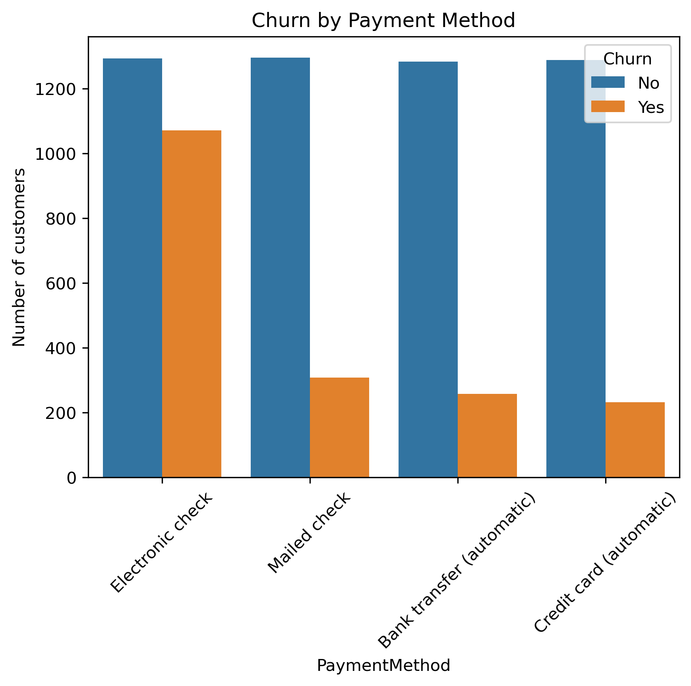
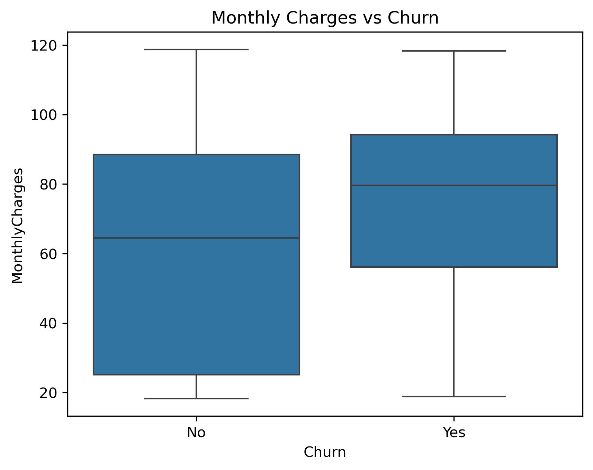
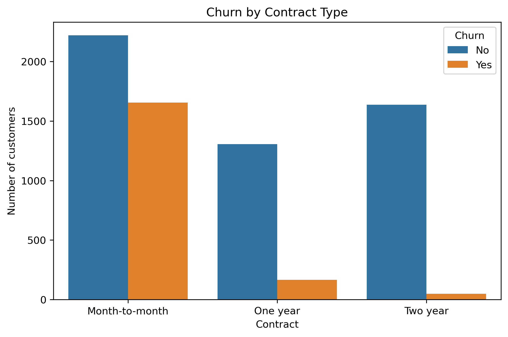
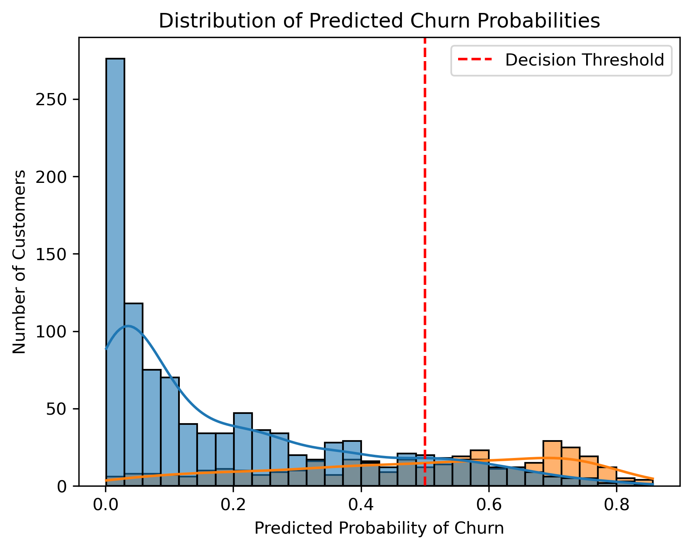
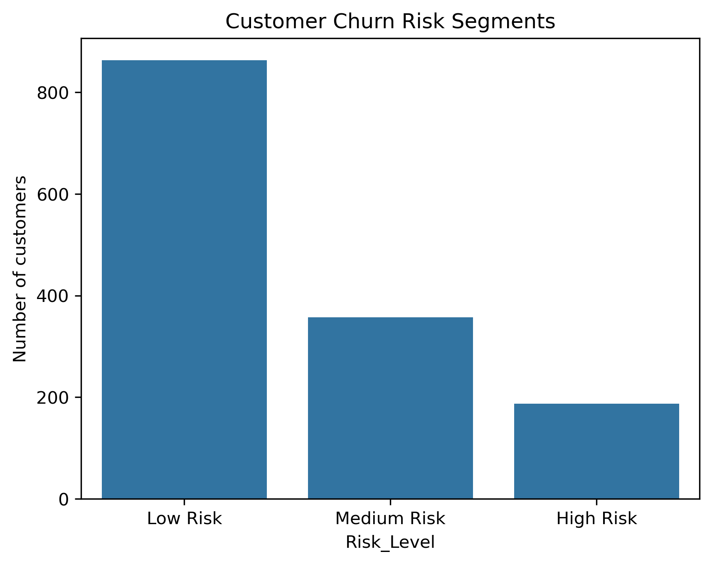

# Customer Churn Analysis & Prediction

## Project Overview


Customer churn is a major challenge for subscription-based businesses. When customers leave a service, companies lose recurring revenue and must invest additional resources to acquire new customers.

This project analyzes telecom customer data to identify patterns behind customer churn and build a predictive model to estimate churn probability.

The project includes:
- Exploratory Data Analysis (EDA)
- Churn driver analysis
- Machine learning prediction model
- Customer risk segmentation
- Business recommendations

---

## Dataset

The dataset contains **7,000+ telecom customer records** with information about:

- Customer demographics
- Subscription services
- Billing details
- Contract type
- Payment method
- Churn status

Target variable:

**Churn**
- `1` → Customer left the service
- `0` → Customer retained

---

## Tools & Technologies

- Python
- Pandas
- NumPy
- Matplotlib
- Seaborn
- Scikit-learn
- Jupyter Notebook

---

## Project Workflow

### 1. Data Cleaning

- Converted `TotalCharges` column to numeric
- Removed missing values
- Prepared dataset for analysis and modeling

### 2. Exploratory Data Analysis (EDA)

Analyzed relationships between churn and key features including:

- Contract type
- Customer tenure
- Monthly charges
- Payment method

### 3. Machine Learning Model

A **Logistic Regression model** was trained to predict churn probability.

Model evaluation includes:
- Accuracy score
- Confusion matrix
- Classification report

### 4. Feature Importance

Analyzed model coefficients to identify key drivers of churn.

### 5. Customer Risk Segmentation

Customers were segmented into:

- **Low Risk**
- **Medium Risk**
- **High Risk**

based on predicted churn probabilities.

---

## Key Insights

- Customers on **month-to-month contracts have the highest churn rate**
- Customers with **short tenure are more likely to churn**
- **Higher monthly charges correlate with increased churn probability**
- Customers using **electronic check payment methods churn more frequently**

---

## Business Recommendations

Based on the analysis, companies can reduce churn by:

- Encouraging customers to switch to **long-term contracts**
- Offering incentives for **high-risk customers**
- Improving onboarding for **new customers**
- Promoting **automatic payment methods**

---

## Visualizations

### Churn by Payment Method



### Churn by Monthly Charges




### Churn by Contract Type



### Churn Probability Distribution



### Customer Risk Segmentation



---

## Repository Structure

```
customer-churn-analysis
│
├── data
│   └── telco_customer_churn.csv
│
├── notebook
│   └── customer_churn_analysis.ipynb
│
├── visuals
│   ├── churn_distribution.png
│   ├── churn_by_contract.png
│   ├── churn_probability_distribution.png
│   └── churn_risk_segments.png
│
├── README.md
└── requirements.txt
```

## How to Run the Project

-  Clone the repository
```bash
git clone https://github.com/Loveena28/customer-churn-analysis.git
```

- Install required libraries
```bash
pip install -r requirements.txt
```
- Open the notebook
```bash 
jupyter notebook notebook/customer_churn_analysis.ipynb
```

## Future Improvements

- Experiment with additional machine learning models
- Add feature engineering for improved prediction
- Build an interactive dashboard for churn insights

---

## Author

Loveena Ramchandani

LinkedIn: https://linkedin.com/in/loveenaramchandani 
GitHub: https://github.com/Loveena28


